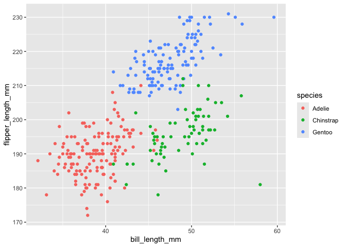

p8105_hw1_mts2203
================
Madeline Sharp
2026-09-19

# Problem 0

## Loading Libraries

``` r
# loading tidyverse library
library(tidyverse)
```

# Problem 1: Coding and Plotting Penguins Dataset

## Loading and Printing Data

``` r
# loading penguins dataset from palmerpenguins package
data("penguins", package = "palmerpenguins")

# printing penguins dataset
penguins
```

    ## # A tibble: 344 × 8
    ##    species island    bill_length_mm bill_depth_mm flipper_length_mm body_mass_g
    ##    <fct>   <fct>              <dbl>         <dbl>             <int>       <int>
    ##  1 Adelie  Torgersen           39.1          18.7               181        3750
    ##  2 Adelie  Torgersen           39.5          17.4               186        3800
    ##  3 Adelie  Torgersen           40.3          18                 195        3250
    ##  4 Adelie  Torgersen           NA            NA                  NA          NA
    ##  5 Adelie  Torgersen           36.7          19.3               193        3450
    ##  6 Adelie  Torgersen           39.3          20.6               190        3650
    ##  7 Adelie  Torgersen           38.9          17.8               181        3625
    ##  8 Adelie  Torgersen           39.2          19.6               195        4675
    ##  9 Adelie  Torgersen           34.1          18.1               193        3475
    ## 10 Adelie  Torgersen           42            20.2               190        4250
    ## # ℹ 334 more rows
    ## # ℹ 2 more variables: sex <fct>, year <int>

## Short Description

The `palmerpenguin` dataset `penguins` presents a list of 344 penguins
that are categorized by `species`, `island`, `bill_length_mm`,
`bill_depth_mm`, `flipper_length_mm`, `body_mass_ (grams)_g`, `sex` and
`year`. The dataset contains 344 rows and 8 columns. The penguin’s mean
flipper length is 200.9152047.

## Creating Scatterplot

``` r
# defining scatterplot of flipper_length_mm vs. bill_length_mm using penguins data
scatterplot_penguins = ggplot(data = penguins, aes(x = bill_length_mm, y = flipper_length_mm, color = species)) + geom_point() 

# prining scatterplot
scatterplot_penguins 
```

    ## Warning: Removed 2 rows containing missing values or values outside the scale range
    ## (`geom_point()`).

<!-- -->

``` r
# creating and saving scatterplot as a pdf
ggsave("scatterplot_penguins.pdf", height = 4, width = 6)
```

    ## Warning: Removed 2 rows containing missing values or values outside the scale range
    ## (`geom_point()`).

# Problem 2: Variable Types and Coercion

## Defining and Printing Dataframe

``` r
# defining dataframe containing numeric, logical, character and factor vectors
vec_dt_df =
  tibble(
    vec_num = rnorm(n = 10),
    vec_log = vec_num > 0,
    vec_char = c("This", "is","my", "first", "homework", "assignment", "for", "Data", "Science", "1"),
    vec_fact = factor(c("YES", "NO","MAYBE", "YES", "NO", "MAYBE", "YES", "NO", "MAYBE", "YES"))
  )

# printing dataframe containing numeric, logical, character and factor vectors
vec_dt_df
```

    ## # A tibble: 10 × 4
    ##    vec_num vec_log vec_char   vec_fact
    ##      <dbl> <lgl>   <chr>      <fct>   
    ##  1  0.698  TRUE    This       YES     
    ##  2 -0.228  FALSE   is         NO      
    ##  3  1.05   TRUE    my         MAYBE   
    ##  4  1.34   TRUE    first      YES     
    ##  5 -1.23   FALSE   homework   NO      
    ##  6 -0.315  FALSE   assignment MAYBE   
    ##  7 -0.0323 FALSE   for        YES     
    ##  8 -0.286  FALSE   Data       NO      
    ##  9  0.350  TRUE    Science    MAYBE   
    ## 10  1.54   TRUE    1          YES

## Calculating Dataframe Vector Means

- The vec_num mean is: 0.2894178.
- The vec_log mean is: 0.5.
- The vec_char mean is: NA.
- The vec_fact mean is: NA.

## Explaining Mean Results

Finding the mean is a numerical operation, therefore the vector
variables of character and factor data types should not and do not
produce means. However, the numerical and logical vector variables
should and do generate means. Logical vectors are stores as 1 for “TRUE”
and 0 for “FALSE”, hence why they can be averaged numerically.
